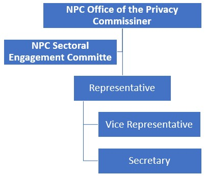

# DATA PRIVACY SECTORAL CODE OF CONDUCT: 
TRANSPORT AND LOGISTICS

# **I. Title.**

This shall be known and cited as the Data Privacy Sectoral Code (“DPSC”, “Sectoral Code”) for the Transport and Logistics (“Sector”) under the Data Privacy Council (“DP Council”) formed by the National Privacy Commission (“NPC”) as a mechanism for collaboration and knowledge-sharing among its members as well as with the members of other DP Sectoral Councils, with the goal of continuously strengthening sectoral compliance, and developing and supporting programs for the sector.

# **II. Purposes of the Code.**

In line with the NPC’s vision to uphold the public’s right to privacy and data protection, this Sectoral Code sets out how the Sector will provide guidance to its members in their practice of leading data privacy initiatives and protecting personal data in their respective companies and in sharing best practices within the Sector and the bigger community of data privacy practitioners.

# **III. Ownership of the Code.**

This Sectoral Code shall be owned and maintained by the Transport and Logistics Sector, and any change thereof shall be facilitated by the Sectoral Members through its officers and shall follow the same approval process of the Sectoral Code by the National Privacy Commission set forth in this Sectoral Code.

# **IV. Scope of the Code.**

The Sectoral Code covers all Personal Information Controllers (“PICs”) and Personal Information Processors (“PIPs”) as defined in the Data Privacy Act of 2012, which have multiple industries and are often large and may have international presence. These companies may have stakes in many diverse and independent businesses which operate separately.

All PICs and PIPs are required to identify their Sector during registration with the NPC Registration System (“NPCRS”) and will be contacted by their respective Sectoral Officer in-charge of Sectoral member to join the DP Sectoral Council.  This Code applies comprehensively to:

- All directors, officers, employees (irrespective of employment status – permanent, probationary, contractual, or temporary), consultants, agents, and third-party service providers who, in the course of their engagement with or on behalf of member organizations of the Group, collect, access, use, process, store, or otherwise handle personal data related to the diverse operations within the transport and logistics sector.
- All personal data processed by or for member organizations of the Group, regardless of the medium in which it is held (e.g., physical documents, digital files, databases) or the location of processing (e.g., on-premises servers, cloud-based platforms, mobile devices).
- The DPA's provisions, including its extraterritorial application.

# **V. Vision.**

To uphold the highest standards of data privacy in the Transport and Logistics sector.

# **VI. Mission.**

To provide guidance to its members in their practice of leading data privacy initiatives and protecting personal data, and in sharing best practices within the Sector and the bigger community of data privacy practitioners.

# **VII. Structure of the Sector.**

The Sectoral Council structure will have three (3) Sectoral Officers: Representative, Vice-Representative, and Secretary.

# **VIII. Membership in the Sector.**

This section discusses who can participate in the sector. This will also cover the members’ rights, privileges, and responsibilities. It also includes frequency of sector meetings and documents needed to be maintained by each member.

## Section 1. Sectoral Members.

Sectoral members must be represented by the Data Protection Officers (DPOs) of their organizations.

## Section 2. Requirements for Sectoral Membership.

Registered organizations in the NPCRS will be required to become a member in the Sector and provide the following:

- Personal information of sectoral members including name, name of organization, position in the organization, contact details, as well as other information which may be collected by the Sectoral Officers, DPC or NPC DPC Committee which are necessary for the execution of programs of the Sector.
- Data privacy consent for the processing of personal data by the Sectoral Officers, the DPC and the NPC DPC Committee.
- Endorsement by the Sectoral Officers and/or the NPC DPC Committee.

## Section 3. Responsibilities of members.

- Maintain annual registration of his/her organization.
- Update registration and details of representatives with the Sector.
- Attend Sectoral meetings, activities and trainings.
- Provide inputs and professional opinions on draft circulars, advisories or issuances by the NPC through the Sectoral officers.

## Section 4. Benefits of membership

Members of the Sector will have the following benefits:
- Keeping abreast with updates from the National Privacy Commission through the sectoral officers;
- Active participation in lobbying to the Commission a proposal to issue Circulars and Advisories affecting the rights of data subjects, or their amendments;
- Opportunities to network with other sectoral members; and
- Knowledge sharing of company’s (or agency’s) best data privacy practices with other sectoral members.

## Section 5. Conduct of members.

In his/her dealing, a sector member is expected to:
- Be respectful and observe proper decorum when interacting with other members;
- Be compliant with all privacy and data protection laws and regulations;
- Act in a manner that is in the best interest of the sector and its members including respect for privacy and personal information;
- Use every opportunity to help in advancing the welfare of sector through individual contribution, team or functional leadership in the sector;
- Make appropriate use of knowledge or information resulting from sectoral membership;
- Protect the intellectual property of the sector or any information shared by co-members during the sectoral events and ensure its use in an approved manner; and
- Accept and abide by the Sectoral Code and assist co-members who may need assistance including escalating such request for assistance to the Sectoral officers.

# **IX. Officers of the Sector.**

This section discusses: (1) the composition of officers; (2) primary expectations and responsibilities; (3) role of each officer; (4) role of members in supporting and evaluating the officers.

## Section 1. Composition of Sectoral Officers.

The Officers of the Sector shall be composed of one (1) Representative and one (1) Vice Representative, and (1) Secretary, elected by members of the sector members during a meeting which is called for a term of one (1) year which can be extended up to three (3) years, and shall hold office until their successors are duly elected and qualified, or until duly removed for cause.

## Section 2. Qualification of Sectoral Officers.

The sector shall consider the following qualifications in electing its officers:

1. Must be a DPO of his represented Company;
2. Data privacy knowledge relating to the sector;
3. Commitment to the sector’s mission and vision.
4. Ability and willingness to fulfill duties of care, loyalty, and obedience; and
5. Commitment to develop data privacy knowledge and skills of new and existing members.

## Section 3. Election of Sectoral Officers.

Officers shall be elected and called “Representatives.” The election of sectoral officers will be held annually during the NPC DP Council Elections. Before the election, sectoral members will convene separately with the help of the Sectoral Point Person to determine a minimum of ten (10) representatives who shall attend the DP Council Election Proper. Each of the 10 representatives will have 1 vote in the election of their respective sectoral representative and vice-representative. The participants may nominate their preferred representatives and election shall be by showing of hands. The person who incurs the most number of votes shall be deemed as the representative of the sector. The same process shall be undertaken for the vice-representatives. The names of the elected representatives and vice-representatives per sector shall be given to the Commission for validation.

## Section 4. Role of Sectoral Representative.

The Representative is the presiding officer of the sector and is an ex-officio member of all committees, and is a member of the Data Privacy Council and the National Privacy Commission. He or she is responsible in managing the activities, initiatives and meetings of the sector.

## Section 5. Role of Sectoral Vice-Representative.

The Vice-Representative assists the Representative in the performance of his or her duties and shall be the sector’s representative in case of the latter’s absence. He or she shall also be a part of the Data Privacy Council. In the event of the resignation, removal or permanent disability of the Representative, the Vice-Representative shall cease to serve as Vice-Representative and shall immediately succeed to the office of Representative, and thereafter shall serve as Representative for the remainder of the unfulfilled term of the Representative.

## Section 6. Sectoral Officers Reporting and Coordination with NPC.

The sectoral officers shall work hand-in-hand with the Data Privacy Council and the NPC and act on behalf of the sector in the administration of established policies and programs and shall make recommendations on matters of policy and operations. They shall be responsible for representing the sector in the Data Privacy Council and presenting the sector’s updates to the NPC.

## Section 7. Duties of Sectoral Officers.

The sectoral officers are responsible for the governance of the sector. They shall perform the duties pertaining to their respective offices as well as other duties as may be approved by the sector. They shall be entrusted with the administration and management of the affairs of the sector, and shall work hand-in-hand with its members in ensuring that data privacy activities and initiatives are carried out. In the absence of fraud, bad faith or negligence which will amount to a breach of contract, the members cannot interfere with the exercise of sector judgment relating to its management.

## Section 8. Resignation or Removal of Officer.

Any Officer may resign by delivering his or her written resignation to the sector, and such resignation shall be effective upon receipt unless it is specified to be effective at some other time or upon the happening of some other event. Any Officer may be removed by a three-fourths vote of the sector at any time and for any reason.

# **X. Sectoral Assembly.**

## Section 1. Sectoral Meetings.

Regular meetings of the sector shall be attended to by the DPOs and conducted at such place or places, on such data or dates, and at such time or times as shall have been agreed upon by the sectoral members. Notice must be given to members at least one (1) week before the meeting to give ample time for members to prepare.

## Section 2. Manner of Sectoral Meetings.

Sectoral meetings may be face-to-face or by means of videoconference, whatever may be agreed upon by the members of the sector, and depending on the situation or matters to be discussed.

## Section 3. Quorum.

At any sectoral meeting, a majority of the members shall constitute a quorum of the sector. At any sectoral meeting at which a quorum is present, the action of the sector or any matter brought before the meeting shall be decided by the vote of a majority of those present, unless a difference vote is required by law.

# **XI. Data Protection Practices.**

This section discusses the standards of data protection and personal data life cycle processes that should be followed in the specific industry of the sector. It should have a thorough discussion of the industry practices to be taken note of, especially those that vary from each industry such as the retention period and manner of deletion.

## Section 1. Data Collection Practices in the Sector.

- **Data Minimization:** Collect only the personal data that is strictly necessary, adequate, and relevant for the specific, declared, and legitimate purpose for which it is being collected.
- **Transparency:** Customers, passengers, and users must be clearly and concisely informed at the point of data collection about how their personal data will be collected, used, potentially shared, and the duration for which it will be retained.
- **Lawful Basis:** Process personal data only when there is a lawful basis for doing so, as prescribed by the Data Privacy Act of 2012.
- **Consent:** Obtain consent that is freely given, specific, informed, and an explicit indication of will, evidenced by written, electronic, or recorded means.
- **Contractual Necessity:** Process personal data when necessary for the performance of a contract.
- **Legitimate Interests:** Process data if necessary for legitimate interests, except where such interests are overridden by the fundamental rights and freedoms of the data subject.
- **Other Lawful Grounds:** Process data when necessary for compliance with a legal obligation; to protect vitally important interests; to respond to a national emergency, public order, and safety; or for the fulfillment of functions of a public authority.

## Section 2. Data Storage Practices in the Sector.

- **Security:** All shipping documents, passenger manifests, booking records, whether physical or digital, that contain personal data must be handled and stored securely to prevent unauthorized access, loss, or disclosure.
- **Access Control to Facilities:** Implement policies and procedures to monitor, limit, and control physical access to premises, data centers, server rooms, and other areas where personal data is processed or stored.
- **Workstation and Document Security:** Implement clean desk policies, procedures for securing physical documents containing personal data, and securing unattended workstations.
- **Secure Disposal of Physical Media:** Establish formal procedures for the secure disposal of physical media containing personal data, such as shredding paper documents and physically destroying or degaussing hard drives and other storage devices.
- **Environmental Protection:** Implement measures to protect data processing facilities and stored data from natural disasters, power fluctuations, and other environmental threats.

## Section 3. Data Use Practices in the Sector.

- **Purpose Limitation:** Use personal data only for the explicit purposes of service fulfillment, customs and regulatory compliance, billing and payment processing, customer service, and other directly related and legitimate operational requirements.
- **Data Accuracy:** Take all reasonable steps to ensure the accuracy and completeness of personal data at the point of collection and throughout the period it is retained and used.
- **Employee Data:** Process employee data with a lawful basis, ensuring confidentiality and implementing access controls. Retain data in accordance with applicable laws and company policy.
- **Tracking Technologies:** Use data collected from tracking technologies (GPS, RFID) only for clearly defined and legitimate purposes, such as fleet/aircraft/vessel management, route optimization, cargo/passenger security, and ensure that the data collected is proportional to the stated purpose.
- **CCTV Surveillance:** Operate CCTV systems in compliance with NPC guidelines, with a legitimate purpose, proper notice, and proportionality. Access to footage must be restricted, and footage should be retained only as long as necessary.

## Section 4. Data Transfer Practices in the Sector.

- **Lawful Basis:** All data sharing must have a lawful basis, such as consent, necessity for the performance of a contract, or compliance with a legal obligation.
- **Data Sharing Agreements (DSAs):** Execute legally binding DSAs with third parties before sharing personal data, clearly defining the purpose, types of data, responsibilities, security measures, and data retention and disposal requirements.
- **Due Diligence:** Conduct due diligence on third parties before entering into data sharing arrangements.
- **Data Minimization:** Share only the minimum amount of personal data necessary.
- **Cross-Border Data Transfers:** Comply with DPA rules for international data transfers, ensuring a lawful basis and adequate safeguards.

## Section 5. Data Deletion/Destruction Practices in the Sector.

- **Data Retention Schedule:** Establish and adhere to a data retention schedule that specifies the retention periods for different categories of personal data.
- **Secure Disposal:** Dispose of personal data securely to prevent unauthorized access, use, or recovery, using methods such as shredding, permanent deletion, degaussing, or crypto-shredding.

## Section 6. Data Security Measures in the Sector.

Implement reasonable and appropriate organizational, physical, and technical security measures, including:

- Appointment and Registration of a Data Protection Officer (DPO).
- Development and implementation of data protection policies.
- Maintenance of records of processing activities.
- Human resource management measures, including training and confidentiality agreements.
- Third-party vendor management and due diligence.
- Privacy Impact Assessments (PIAs) before implementing new projects or systems.
- Access controls, encryption, network security, data discovery and classification, security monitoring, software and system security, mobile device security, and privacy by design and default.

# **XII. Sectoral Compliance Frameworks and References.**

This section discusses the comprehensive approach comprised of the policies, plans, processes, procedures, resources, training programs and systems used to manage the identification of and adherence to data privacy compliance obligations to which the sector must comply with.
Examples: ISO, Quality Management System (QMS), Cybersecurity Law

## Section 1. ISO 9001 Quality Management System.

The Quality Management System (QMS) integrates the various internal processes within the organization and intends to provide a process approach for project execution. In an ISO 9001 quality system, the structured way of delivering a better service or product is supported by documented information such as procedures, work instructions, policies, and forms.

## Section 2. Sectoral Compliance Principles.

This section covers the foundation of the compliance management framework. This will be used to guide the sector in the implementation of the compliance-related activities within their respective organizations.

- Transparency
- Legitimate Purpose
- Proportionality
- Data Quality (Accuracy)
- Security (Confidentiality, Integrity, Availability)
- Accountability

## Section 3. Sectoral Compliance Model.

This section discusses the options for achieving compliance and involves:

- Setting regulatory requirements that are clear, practical, measurable and enforceable;
- Promoting requirements to ensure they are widely known by the regulated community and the public, and in ways that encourage individuals and businesses to comply;
- Verifying (through monitoring and audits) that individuals and businesses are meeting their regulatory requirements; and
- Where these requirements are not being met, adjusting the program management approach and, where appropriate, compelling compliance through enforcement.

# **XII. Accountability.**

This section discusses the processes that the sector and officers may take to ensure that the sector has an efficient management and governance system of its members. This also includes the composition of the group that may conduct an audit of the sector’s activities and programs. This includes:

- The leadership of the Transport and Logistics Data Privacy Group and the management of its member organizations are fully committed to championing a culture of data privacy and security, providing necessary resources, and integrating data privacy into corporate governance.
- Each member organization, where required, shall designate or appoint a Data Protection Officer (DPO) with key responsibilities.
- Every individual working for a member organization has a personal responsibility to understand and comply with data privacy laws and policies, handle data securely, limit access, report violations, and complete training.
- Managers and team leaders have additional responsibilities to ensure team compliance, promote a privacy culture, embed privacy considerations into processes, provide support, and cooperate with the DPO.
- Establishment of a Data Breach Response Team (DBRT) with defined roles and responsibilities for managing data breaches.
- Regular internal audits and assessments of data processing activities.

# **XIV. Miscellaneous Provisions.**

## Section 1. Promulgation and Effectivity of Code.

This Code shall take effect on the ___ day of ___ following its publication.

## Section 2. Oath of Office.

All sectoral officers shall take their oath of office, in the prescribed form, before they discharge the function of their respective offices.

## Section 3. Contracts.

Except as otherwise provided, the sector may authorize any officer or member to enter into any contract or to execute or deliver any instrument on the behalf of the sector and such authority may be general or confined to specific instances.

## Section 4. Preservation of Other Rights.

Nothing in this Code affects other legal rights which a Data Subject may have in relation to a Contract or a Data Sharing Agreement, as provided in other applicable laws.

## Section 5. Amendments.

This Code may be altered, amended, or repealed by a vote of majority of the sector at any regular or special sectoral meeting.